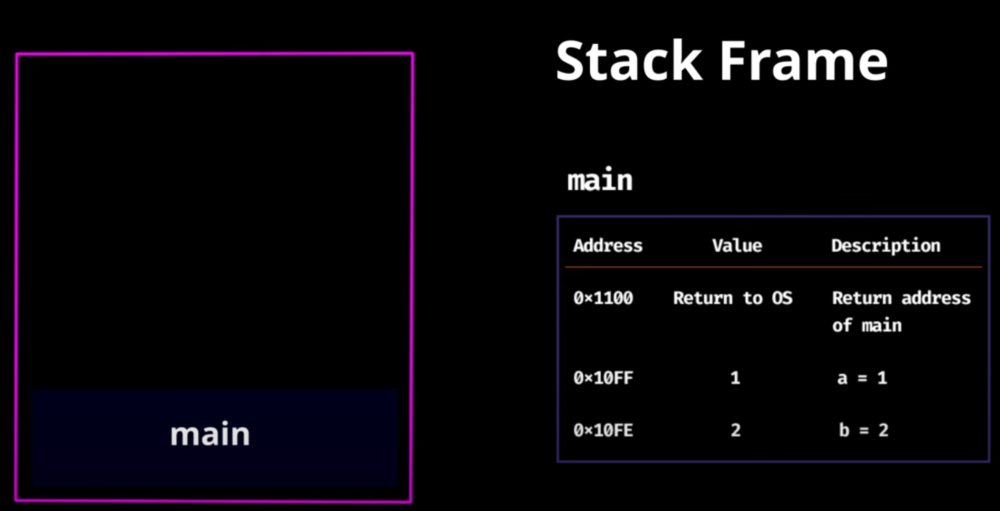
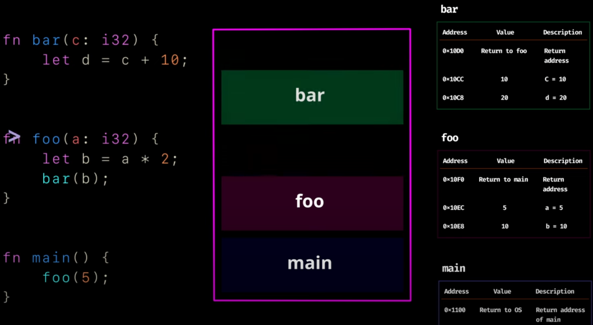
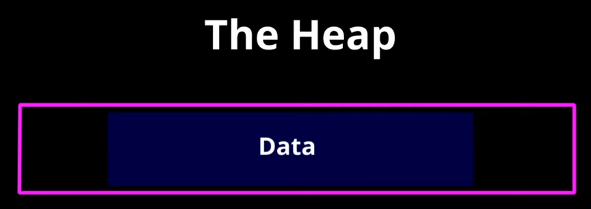
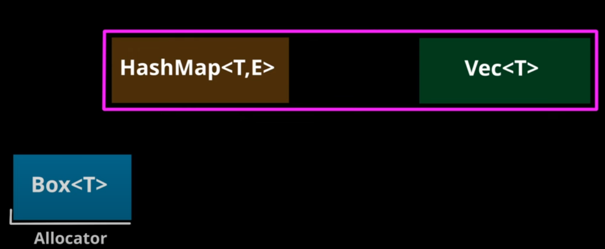
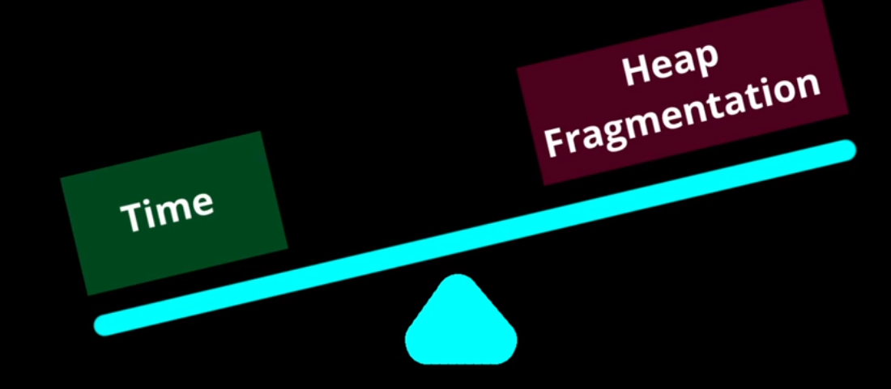
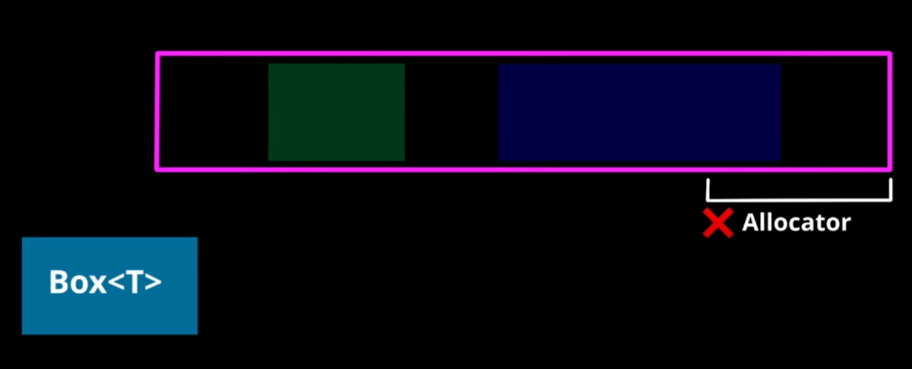
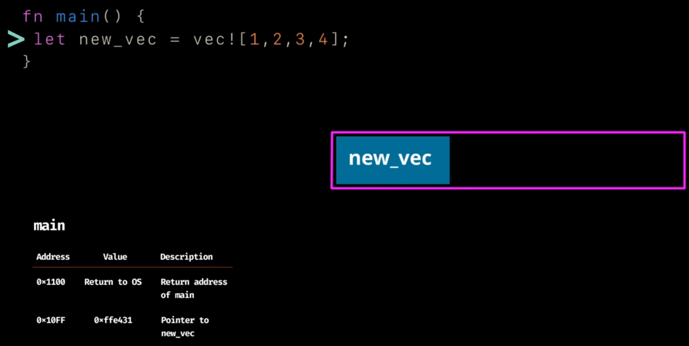

# Understanding Ownership
Ownership is Rust's unique feature and has deep implications for the rest of the language. it enables Rust to make memory safety guarantees without needing a garbage collector, so it's important to understand hot it works.

## What is Ownership
Ownership is set of rules that govern how Rust program manages memory. All program have to manage the way they use a computer's memory while running. Some languages have garbage collector that regularly looks for no-longer-used memory as the program runs.

**Rust uses a third approach: memory is managed through a system of ownership with a set of rules that the compiler checks. If any of the rules are violated, the program won't compile. None of the features of the ownership will down your program while it's running.**

- **The Stack** is a last-in, first-out (LIFO) structure for data with a known, fixed size. Adding data is called *pushing* and removing it is *popping*. It is very fast because new data always goes on top.

  
- **The Heap** is a less organized area for **DATA** of unknown or changing size. Allocating memory here is slower, as the system must find and reserve a large enough space, returning a *pointer* (an address) to that location. This pointer, being a fixed size, is stored on the stack.

- **Pointer**

In Rust, the term "pointer" encompasses a range of types that refer to data stored in memory. These include references, smart pointers, and raw pointers.

- **References**
   References are the most common and safest form of "pointer" in Rust, indicated by the & symbol.
   They borrow a value, meaning they don't take ownership but allow access to the data.
   Rust enforces strict rules for references at compile time, preventing common pointer-related errors like null pointer dereferences or data races.
   There are two main types:
   &T: Immutable reference (shared and read-only).
   &mut T: Mutable reference (exclusive and read-write).

- **Smart Pointers**:
   Smart pointers are data structures that act like pointers but provide additional metadata and capabilities.
   They are defined in the standard library and manage memory and ownership in various ways.
   Examples include:
   Box<T>: For heap allocation, similar to malloc in C.
   Rc<T> (Reference Counting): Allows multiple ownership in single-threaded environments.
   Arc<T> (Atomic Reference Counting): Similar to Rc<T> but safe for multi-threaded environments.
   RefCell<T>: Allows interior mutability, enabling mutable access to data even through an immutable reference.
   Weak<T>: Used with Rc<T> or Arc<T> to prevent reference cycles.

- **Raw Pointers**:
   Raw pointers (*const T for immutable and *mut T for mutable) are the closest equivalent to C-style pointers in Rust.
   They are used in unsafe blocks and bypass Rust's compile-time safety guarantees.
   Raw pointers offer direct memory access and are primarily used when interacting with C libraries or implementing low-level data structures where Rust's safety guarantees cannot be easily applied.
   They do not have ownership semantics and require manual memory management.

**Key Comparisons:**
*   **Speed:** The stack is faster for allocation and access. The heap is slower because allocating requires a search and accessing data requires following a pointer.
*   **Function Calls:** When a function is called, its arguments and local variables are pushed onto the stack and popped off when the function ends.

## References and Borrowing

    fn main() {
        let s1 = String::from("hello");
    
        let len = calculate_length(&s1);
    
        println!("The length of '{s1}' is {len}.");
    }

    fn calculate_length(s: &String) -> usize {
        s.len()
    }

    The length of 'hello' is 5.

First, notice that all the tuple code in the variable declaration and the function return value is gone. Second, note that we pass &s1 into calculate_length and, in its definition, we take &String rather than String. These ampersands (&) represent references, and they allow you to refer to some value without taking ownership of it. Figure 4-6 depicts this concept.

Figure 4-6: A diagram of &String s pointing at String s1

### Attempting to modify a borrowed value
o, what happens if we try to modify something we’re borrowing? Try the code in Listing 4-6. Spoiler alert: it doesn’t work!

    fn main() {
        let s = String::from("hello");
    
        change(&s);
    }
    
    fn change(some_string: &String) {
        some_string.push_str(", world");
    }

    $ cargo run
    Compiling ownership v0.1.0 (file:///projects/ownership)
    error[E0596]: cannot borrow `*some_string` as mutable, as it is behind a `&` reference
    --> src/main.rs:8:5
    |
    8 |     some_string.push_str(", world");
    |     ^^^^^^^^^^^ `some_string` is a `&` reference, so the data it refers to cannot be borrowed as mutable
    |
    help: consider changing this to be a mutable reference
    |
    7 | fn change(some_string: &mut String) {
    |                         +++
    
    For more information about this error, try `rustc --explain E0596`.
    error: could not compile `ownership` (bin "ownership") due to 1 previous error

## Mutable References
We can fix the previous code.

    fn main() {
        let mut s = String::from("hello");
    
        change(&mut s);
    }
    
    fn change(some_string: &mut String) {
        some_string.push_str(", world");
    }

## Dangling References
